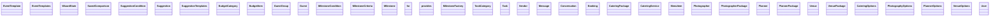

# models Class Diagram

```mermaid
classDiagram
  class EventTemplate
  class EventTemplates
  class WizardState
  class SavedComparison
  class SuggestionCondition
  class Suggestion
  class SuggestionTemplates
  class BudgetCategory
  class BudgetItem
  class GuestGroup
  class Guest
  class MilestoneCondition
  class MilestoneCriteria
  class Milestone
  class for
  class provides
  class MilestoneFactory
  class TaskCategory
  class Task
  class Vendor
  class Message
  class Conversation
  class Booking
  class CateringPackage
  class CateringService
  class MenuItem
  class Photographer
  class PhotographerPackage
  class Planner
  class PlannerPackage
  class Venue
  class VenuePackage
  class CateringOptions
  class PhotographyOptions
  class PlannerOptions
  class VenueOptions
  class User
```
