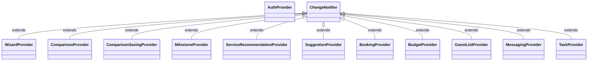

# providers Class Diagram

```mermaid
classDiagram
  class AuthProvider
  class WizardProvider
  class ComparisonProvider
  class ComparisonSavingProvider
  class MilestoneProvider
  class ServiceRecommendationProvider
  class SuggestionProvider
  class BookingProvider
  class BudgetProvider
  class GuestListProvider
  class MessagingProvider
  class TaskProvider
  ChangeNotifier <|-- WizardProvider : extends
  ChangeNotifier <|-- ComparisonProvider : extends
  ChangeNotifier <|-- ComparisonSavingProvider : extends
  ChangeNotifier <|-- MilestoneProvider : extends
  ChangeNotifier <|-- ServiceRecommendationProvider : extends
  ChangeNotifier <|-- SuggestionProvider : extends
  ChangeNotifier <|-- BookingProvider : extends
  ChangeNotifier <|-- BudgetProvider : extends
  ChangeNotifier <|-- GuestListProvider : extends
  ChangeNotifier <|-- MessagingProvider : extends
  ChangeNotifier <|-- TaskProvider : extends
```
