# Interactive Event Planning Process Diagram

This document provides an interactive diagram of the event planning process in the Eventati Book application.

## Event Planning Process Overview

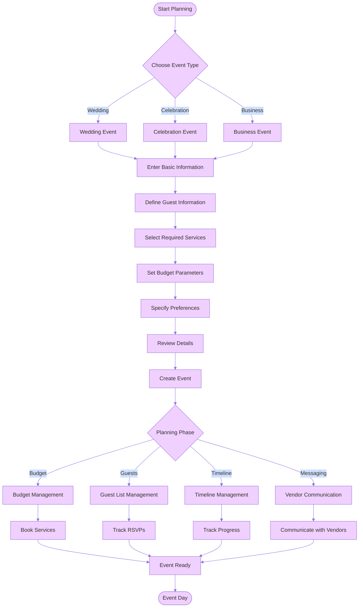

## Event Types

### Wedding Event {#wedding-event}

Wedding events in Eventati Book include specialized features for planning the perfect wedding:

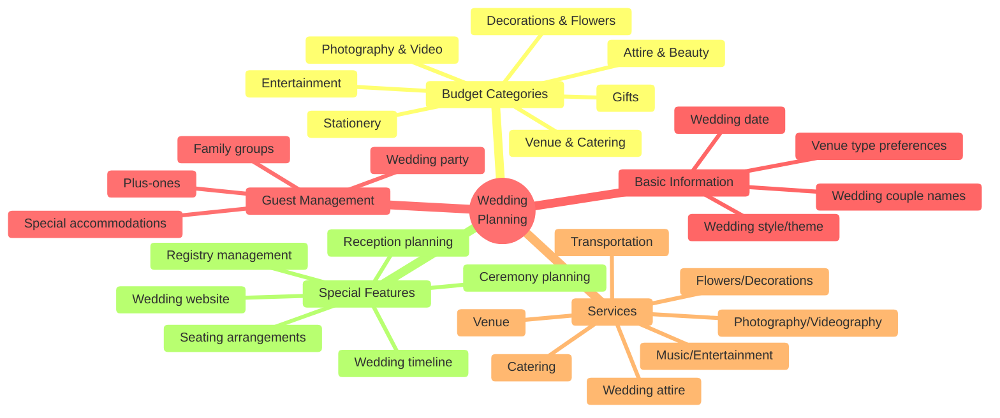

### Celebration Event {#celebration-event}

Celebration events cover birthdays, anniversaries, and other special occasions:

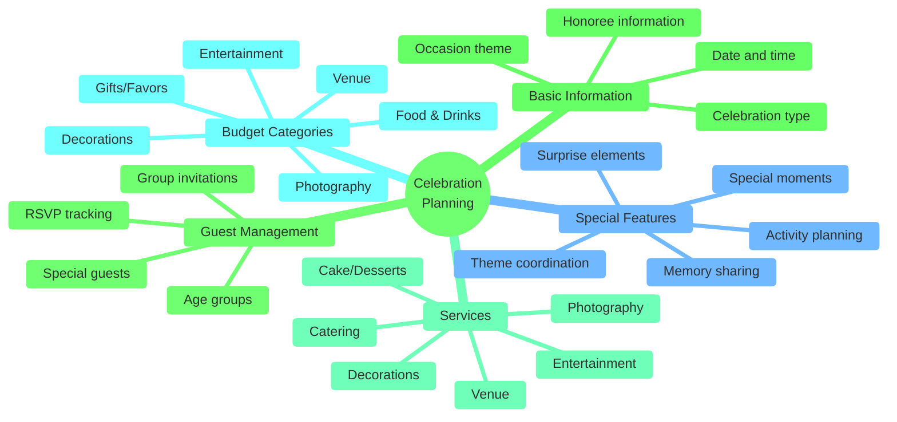

### Business Event {#business-event}

Business events include conferences, seminars, team-building, and corporate functions:

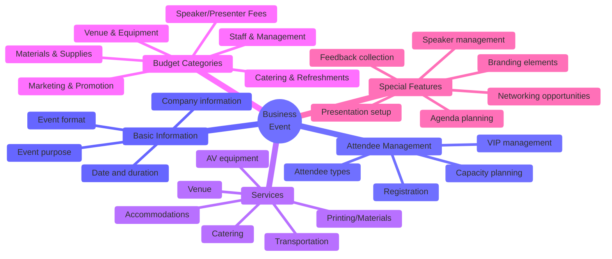

## Planning Tools

### Budget Management {#budget-management}

The budget management tool helps track expenses and stay within budget:

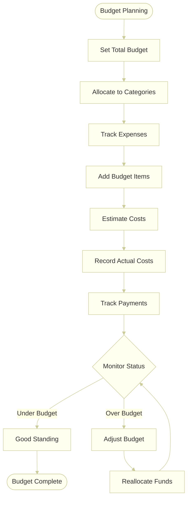

#### Set Total Budget {#set-total-budget}

Setting the total budget involves:

1. Determining overall budget amount
2. Considering funding sources
3. Setting budget flexibility (±10%)
4. Establishing budget timeline

#### Allocate Categories {#allocate-categories}

Budget categories are allocated based on:

1. Event type (wedding, celebration, business)
2. Typical percentage breakdowns
3. Priority services
4. Custom category creation

#### Add Budget Items {#add-budget-items}

Budget items include:

1. Item name and category
2. Estimated cost
3. Actual cost (updated later)
4. Payment tracking
5. Due dates
6. Notes and vendor information

#### Track Payments {#track-payments}

Payment tracking includes:

1. Recording deposits
2. Tracking payment schedules
3. Managing final payments
4. Tracking payment methods
5. Storing receipts/invoices

### Guest Management {#guest-management}

The guest management tool helps organize attendees:

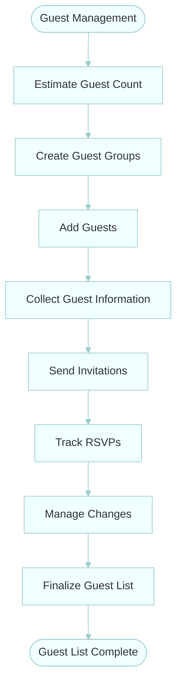

#### Estimate Guest Count {#estimate-guest-count}

Estimating guest count involves:

1. Setting initial target number
2. Considering venue capacity
3. Aligning with budget constraints
4. Planning for different scenarios

#### Create Guest Groups {#create-guest-groups}

Guest groups help organize attendees by:

1. Relationship (family, friends, colleagues)
2. Table assignments
3. Priority tiers
4. Special categories (VIPs, wedding party)

#### Collect Guest Information {#collect-guest-information}

Guest information includes:

1. Name and contact details
2. Email and phone number
3. Dietary restrictions
4. Accommodation needs
5. Plus-one status
6. Special notes

#### Track RSVPs {#track-rsvps}

RSVP tracking includes:

1. Recording responses (attending, declined, pending)
2. Tracking meal choices
3. Managing plus-ones
4. Sending reminders
5. Updating final counts

### Timeline Management {#timeline-management}

The timeline management tool helps track planning milestones:

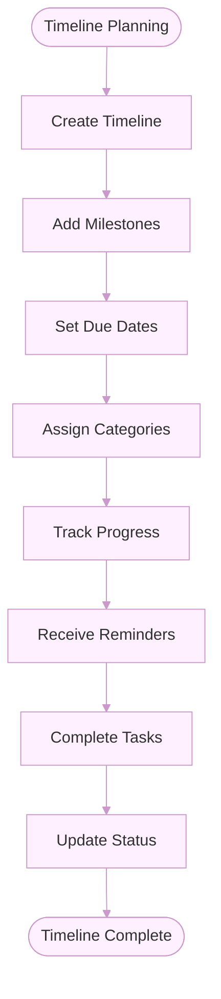

#### Create Timeline {#create-timeline}

Creating a timeline involves:

1. Setting event date as anchor point
2. Working backward to establish planning schedule
3. Identifying key planning phases
4. Setting up timeline structure

#### Add Milestones {#add-milestones}

Milestones include:

1. Task name and description
2. Category assignment
3. Priority level
4. Dependencies on other tasks
5. Notes and details

#### Track Progress {#track-progress}

Progress tracking includes:

1. Marking tasks as complete
2. Viewing percentage complete
3. Identifying overdue tasks
4. Adjusting timeline as needed
5. Visualizing progress

#### Receive Reminders {#receive-reminders}

Reminders help stay on track with:

1. Upcoming deadline notifications
2. Overdue task alerts
3. Important milestone reminders
4. Weekly planning summaries
5. Critical path notifications

### Messaging {#messaging}

The messaging tool facilitates communication with vendors:

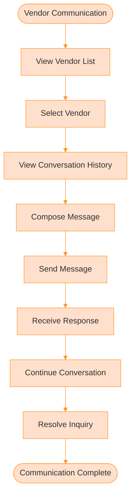

#### View Vendors {#view-vendors}

Vendor management includes:

1. Viewing all booked vendors
2. Sorting by service category
3. Seeing contact information
4. Viewing booking details
5. Managing vendor status

#### View Conversation {#view-conversation}

Conversation history shows:

1. Complete message thread
2. Date and time stamps
3. Read/unread status
4. Attachments and shared files
5. Important message flags

#### Compose Message {#compose-message}

Message composition includes:

1. Writing message content
2. Adding attachments
3. Setting priority level
4. Saving drafts
5. Using templates

#### Receive Response {#receive-response}

Response handling includes:

1. Notification of new messages
2. Quick reply options
3. Message forwarding
4. Marking important information
5. Setting follow-up reminders

## Service Booking {#service-booking}

The service booking process helps secure vendors for the event:

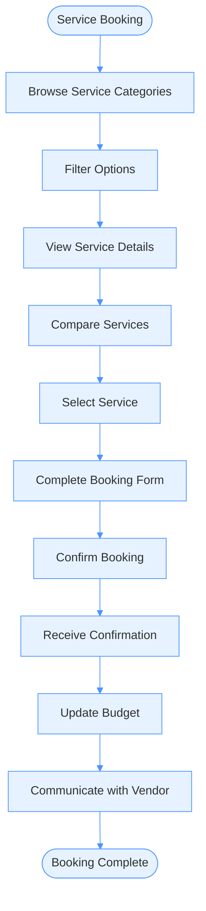

#### Browse Services {#browse-services}

Service browsing includes:

1. Viewing service categories
2. Seeing featured services
3. Browsing recommended options
4. Searching for specific vendors
5. Viewing recently viewed services

#### Filter Options {#filter-options}

Filtering options include:

1. Price range
2. Location/distance
3. Capacity (for venues)
4. Rating/reviews
5. Availability
6. Features and amenities

#### View Details {#view-details}

Service details include:

1. Description and overview
2. Photo gallery
3. Pricing and packages
4. Reviews and ratings
5. Availability calendar
6. Features and amenities
7. Policies and terms

#### Booking Form {#booking-form}

The booking form includes:

1. Date and time selection
2. Package/option selection
3. Special requirements
4. Contact information
5. Payment details
6. Terms acceptance

#### Update Budget {#update-budget}

Budget updates include:

1. Adding booking to budget
2. Recording deposit amount
3. Setting payment schedule
4. Linking to budget category
5. Updating budget status

## Interactive Event Planning Timeline

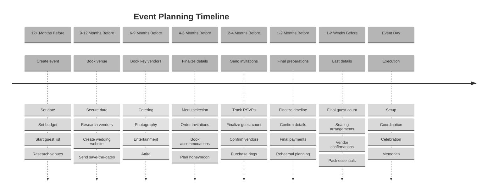

## Event Planning Checklist

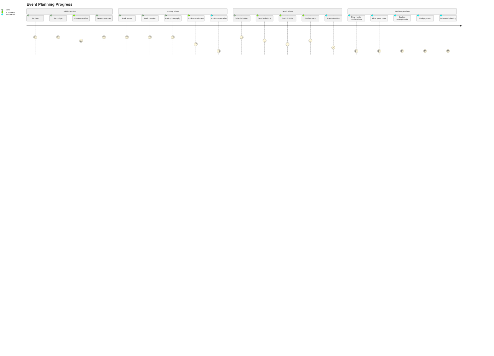
