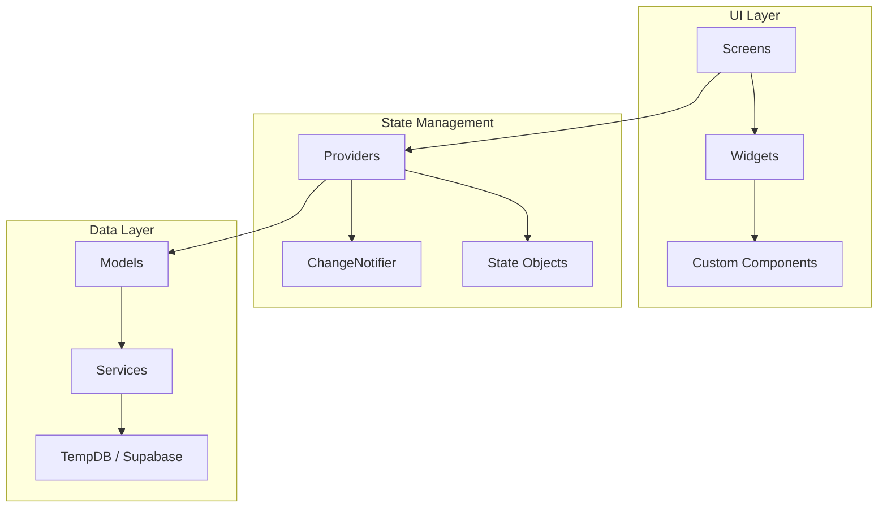
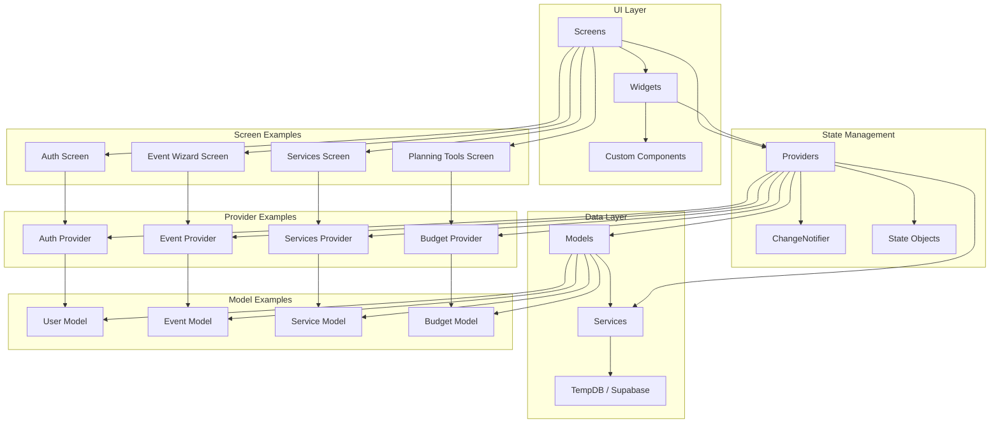
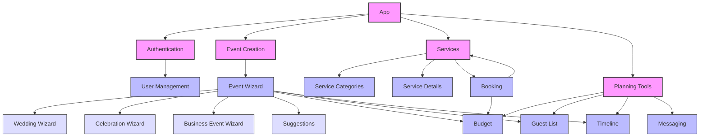
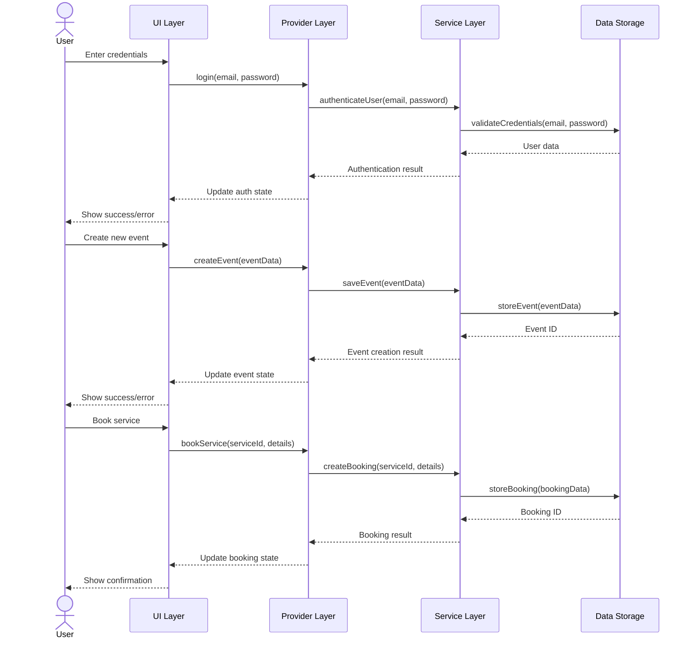
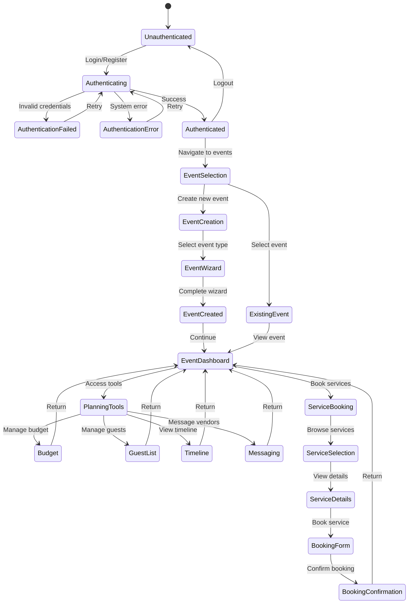
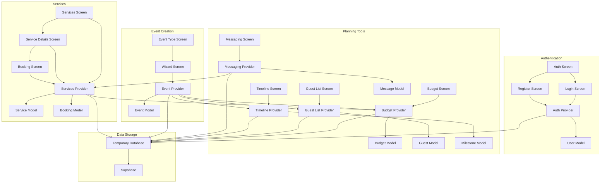
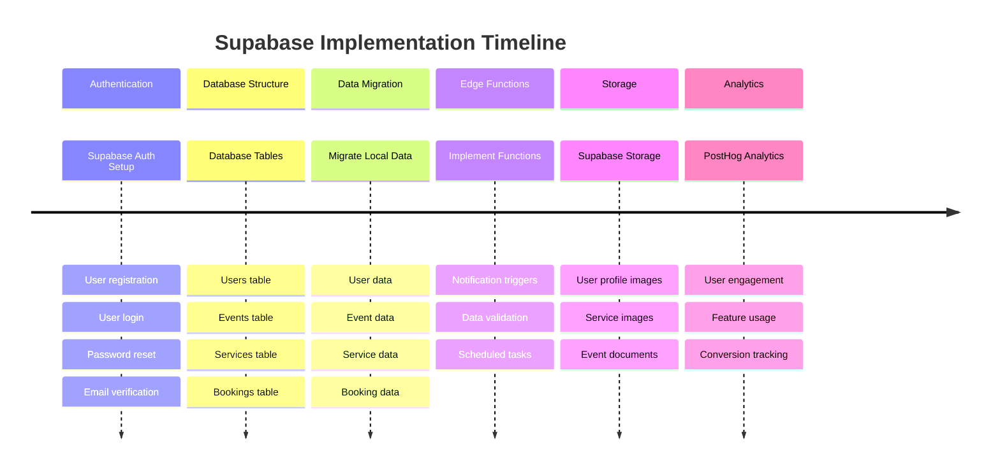
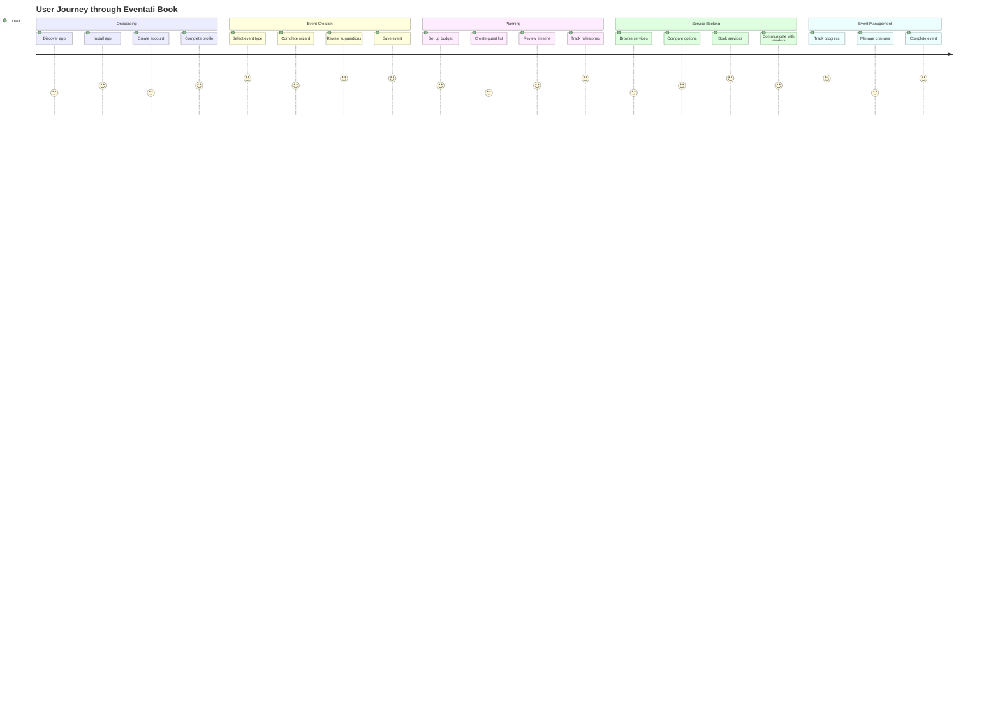

# Application Architecture Diagram

This document provides an interactive architecture diagram of the Eventati Book application using Mermaid.

## Application Architecture Overview

## Detailed Architecture Diagram

## Module Dependencies

## Data Flow Diagram

## State Management Diagram

## Component Interaction Diagram

## Supabase Implementation Plan

## User Flow Diagram

