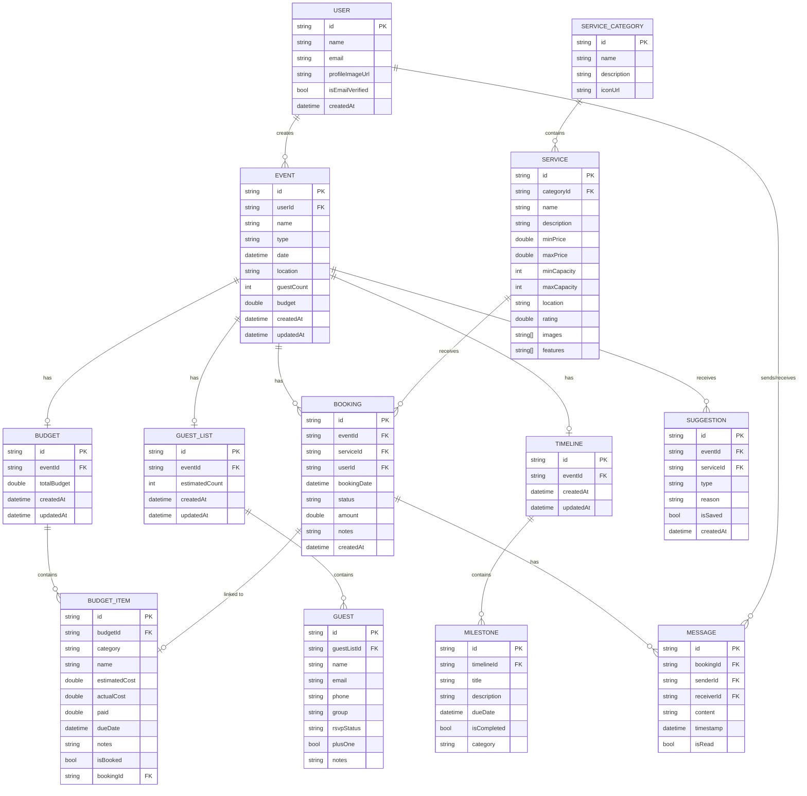
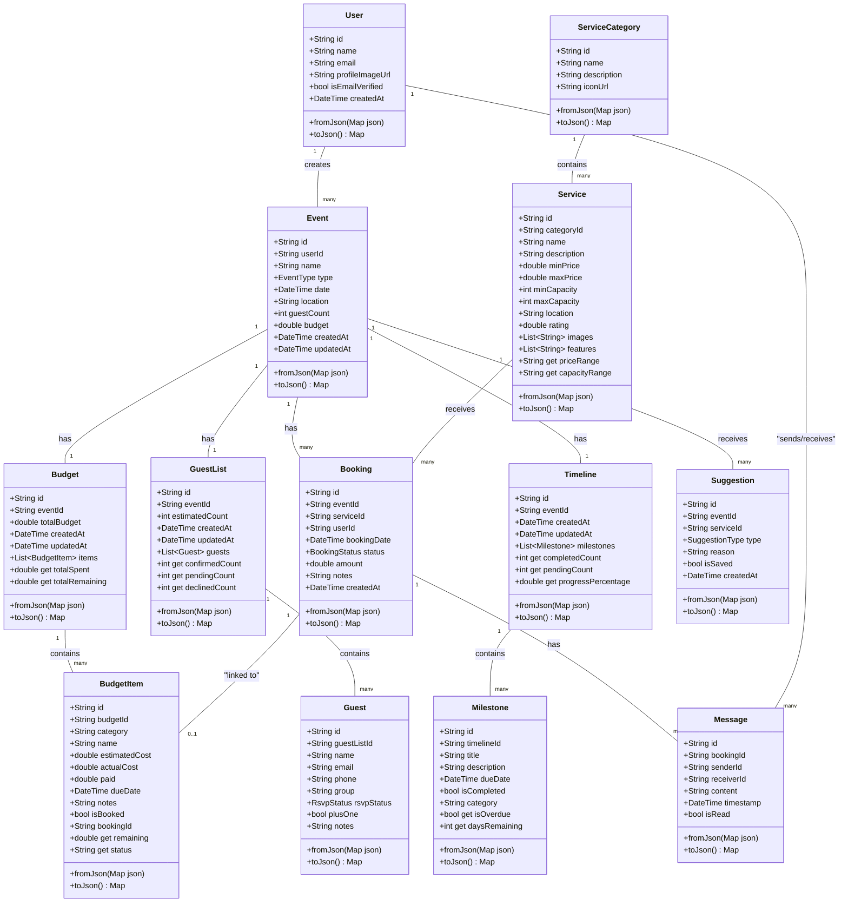
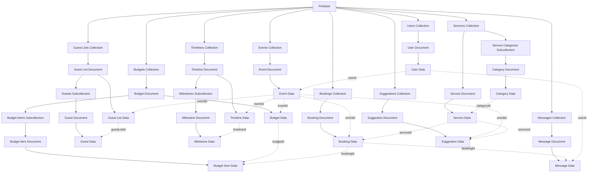

# Data Model Diagram

This document provides an interactive data model diagram of the Eventati Book application using Mermaid.

## Entity Relationship Diagram

## Class Diagram

## Data Flow Diagram

```mermaid
flowchart TD
    %% External entities
    User((User))
    Vendor((Vendor))
    
    %% Processes
    AuthProcess[Authentication Process]
    EventCreationProcess[Event Creation Process]
    BudgetManagementProcess[Budget Management Process]
    GuestManagementProcess[Guest Management Process]
    TimelineProcess[Timeline Management Process]
    ServiceBookingProcess[Service Booking Process]
    MessagingProcess[Messaging Process]
    
    %% Data stores
    UserStore[(User Data)]
    EventStore[(Event Data)]
    BudgetStore[(Budget Data)]
    GuestStore[(Guest Data)]
    TimelineStore[(Timeline Data)]
    ServiceStore[(Service Data)]
    BookingStore[(Booking Data)]
    MessageStore[(Message Data)]
    
    %% Data flows - User to processes
    User -->|Login/Register| AuthProcess
    User -->|Create Event| EventCreationProcess
    User -->|Manage Budget| BudgetManagementProcess
    User -->|Manage Guests| GuestManagementProcess
    User -->|Track Timeline| TimelineProcess
    User -->|Book Services| ServiceBookingProcess
    User -->|Send Messages| MessagingProcess
    
    %% Data flows - Vendor to processes
    Vendor -->|Login/Register| AuthProcess
    Vendor -->|Manage Services| ServiceBookingProcess
    Vendor -->|Send Messages| MessagingProcess
    
    %% Data flows - Processes to data stores
    AuthProcess -->|Store User Data| UserStore
    EventCreationProcess -->|Store Event Data| EventStore
    BudgetManagementProcess -->|Store Budget Data| BudgetStore
    GuestManagementProcess -->|Store Guest Data| GuestStore
    TimelineProcess -->|Store Timeline Data| TimelineStore
    ServiceBookingProcess -->|Store Service Data| ServiceStore
    ServiceBookingProcess -->|Store Booking Data| BookingStore
    MessagingProcess -->|Store Message Data| MessageStore
    
    %% Data flows - Data stores to processes
    UserStore -->|Retrieve User Data| AuthProcess
    EventStore -->|Retrieve Event Data| EventCreationProcess
    BudgetStore -->|Retrieve Budget Data| BudgetManagementProcess
    GuestStore -->|Retrieve Guest Data| GuestManagementProcess
    TimelineStore -->|Retrieve Timeline Data| TimelineProcess
    ServiceStore -->|Retrieve Service Data| ServiceBookingProcess
    BookingStore -->|Retrieve Booking Data| ServiceBookingProcess
    MessageStore -->|Retrieve Message Data| MessagingProcess
    
    %% Cross-process data flows
    EventCreationProcess -->|Initialize| BudgetManagementProcess
    EventCreationProcess -->|Initialize| GuestManagementProcess
    EventCreationProcess -->|Initialize| TimelineProcess
    ServiceBookingProcess -->|Update| BudgetManagementProcess
    
    %% Process to user data flows
    AuthProcess -->|Authentication Result| User
    EventCreationProcess -->|Event Creation Result| User
    BudgetManagementProcess -->|Budget Updates| User
    GuestManagementProcess -->|Guest List Updates| User
    TimelineProcess -->|Timeline Updates| User
    ServiceBookingProcess -->|Booking Confirmation| User
    MessagingProcess -->|Message Delivery| User
    MessagingProcess -->|Message Delivery| Vendor
```

## Firebase Collections Structure

## Model Class Hierarchy

```mermaid
classDiagram
    class BaseModel {
        +String id
        +DateTime createdAt
        +fromJson(Map json)*
        +toJson() Map*
    }
    
    class UserModel {
        +String name
        +String email
        +String profileImageUrl
        +bool isEmailVerified
        +fromJson(Map json)
        +toJson() Map
    }
    
    class EventModel {
        +String userId
        +String name
        +EventType type
        +DateTime date
        +String location
        +int guestCount
        +double budget
        +DateTime updatedAt
        +fromJson(Map json)
        +toJson() Map
    }
    
    class BudgetModel {
        +String eventId
        +double totalBudget
        +DateTime updatedAt
        +List~BudgetItemModel~ items
        +double get totalSpent
        +double get totalRemaining
        +fromJson(Map json)
        +toJson() Map
    }
    
    class BudgetItemModel {
        +String budgetId
        +String category
        +String name
        +double estimatedCost
        +double actualCost
        +double paid
        +DateTime dueDate
        +String notes
        +bool isBooked
        +String bookingId
        +double get remaining
        +String get status
        +fromJson(Map json)
        +toJson() Map
    }
    
    class GuestListModel {
        +String eventId
        +int estimatedCount
        +DateTime updatedAt
        +List~GuestModel~ guests
        +int get confirmedCount
        +int get pendingCount
        +int get declinedCount
        +fromJson(Map json)
        +toJson() Map
    }
    
    class GuestModel {
        +String guestListId
        +String name
        +String email
        +String phone
        +String group
        +RsvpStatus rsvpStatus
        +bool plusOne
        +String notes
        +fromJson(Map json)
        +toJson() Map
    }
    
    class TimelineModel {
        +String eventId
        +DateTime updatedAt
        +List~MilestoneModel~ milestones
        +int get completedCount
        +int get pendingCount
        +double get progressPercentage
        +fromJson(Map json)
        +toJson() Map
    }
    
    class MilestoneModel {
        +String timelineId
        +String title
        +String description
        +DateTime dueDate
        +bool isCompleted
        +String category
        +bool get isOverdue
        +int get daysRemaining
        +fromJson(Map json)
        +toJson() Map
    }
    
    class ServiceCategoryModel {
        +String name
        +String description
        +String iconUrl
        +fromJson(Map json)
        +toJson() Map
    }
    
    class ServiceModel {
        +String categoryId
        +String name
        +String description
        +double minPrice
        +double maxPrice
        +int minCapacity
        +int maxCapacity
        +String location
        +double rating
        +List~String~ images
        +List~String~ features
        +String get priceRange
        +String get capacityRange
        +fromJson(Map json)
        +toJson() Map
    }
    
    class BookingModel {
        +String eventId
        +String serviceId
        +String userId
        +DateTime bookingDate
        +BookingStatus status
        +double amount
        +String notes
        +fromJson(Map json)
        +toJson() Map
    }
    
    class MessageModel {
        +String bookingId
        +String senderId
        +String receiverId
        +String content
        +DateTime timestamp
        +bool isRead
        +fromJson(Map json)
        +toJson() Map
    }
    
    class SuggestionModel {
        +String eventId
        +String serviceId
        +SuggestionType type
        +String reason
        +bool isSaved
        +fromJson(Map json)
        +toJson() Map
    }
    
    BaseModel <|-- UserModel
    BaseModel <|-- EventModel
    BaseModel <|-- BudgetModel
    BaseModel <|-- BudgetItemModel
    BaseModel <|-- GuestListModel
    BaseModel <|-- GuestModel
    BaseModel <|-- TimelineModel
    BaseModel <|-- MilestoneModel
    BaseModel <|-- ServiceCategoryModel
    BaseModel <|-- ServiceModel
    BaseModel <|-- BookingModel
    BaseModel <|-- MessageModel
    BaseModel <|-- SuggestionModel
```

## Provider Dependencies

```mermaid
graph TD
    %% Provider classes
    AuthProvider[Auth Provider]
    EventProvider[Event Provider]
    BudgetProvider[Budget Provider]
    GuestListProvider[Guest List Provider]
    TimelineProvider[Timeline Provider]
    ServiceProvider[Service Provider]
    BookingProvider[Booking Provider]
    MessagingProvider[Messaging Provider]
    SuggestionProvider[Suggestion Provider]
    
    %% Dependencies
    AuthProvider --> EventProvider
    EventProvider --> BudgetProvider
    EventProvider --> GuestListProvider
    EventProvider --> TimelineProvider
    EventProvider --> SuggestionProvider
    
    ServiceProvider --> BookingProvider
    BookingProvider --> BudgetProvider
    BookingProvider --> MessagingProvider
    
    %% Model dependencies
    AuthProvider --> UserModel[User Model]
    EventProvider --> EventModel[Event Model]
    BudgetProvider --> BudgetModel[Budget Model]
    BudgetProvider --> BudgetItemModel[Budget Item Model]
    GuestListProvider --> GuestListModel[Guest List Model]
    GuestListProvider --> GuestModel[Guest Model]
    TimelineProvider --> TimelineModel[Timeline Model]
    TimelineProvider --> MilestoneModel[Milestone Model]
    ServiceProvider --> ServiceCategoryModel[Service Category Model]
    ServiceProvider --> ServiceModel[Service Model]
    BookingProvider --> BookingModel[Booking Model]
    MessagingProvider --> MessageModel[Message Model]
    SuggestionProvider --> SuggestionModel[Suggestion Model]
    
    %% Service dependencies
    AuthProvider --> AuthService[Auth Service]
    EventProvider --> EventService[Event Service]
    BudgetProvider --> BudgetService[Budget Service]
    GuestListProvider --> GuestListService[Guest List Service]
    TimelineProvider --> TimelineService[Timeline Service]
    ServiceProvider --> ServiceService[Service Service]
    BookingProvider --> BookingService[Booking Service]
    MessagingProvider --> MessagingService[Messaging Service]
    SuggestionProvider --> SuggestionService[Suggestion Service]
    
    %% Data storage
    AuthService --> DataStorage[Data Storage]
    EventService --> DataStorage
    BudgetService --> DataStorage
    GuestListService --> DataStorage
    TimelineService --> DataStorage
    ServiceService --> DataStorage
    BookingService --> DataStorage
    MessagingService --> DataStorage
    SuggestionService --> DataStorage
```

