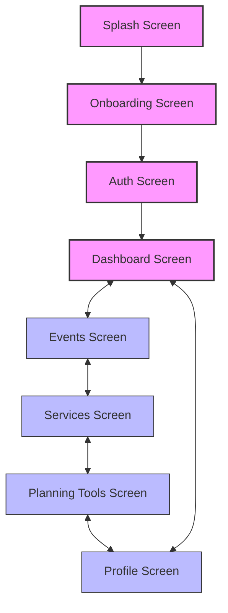

# Navigation Flow Diagram

This document provides an interactive navigation flow diagram of the Eventati Book application using Mermaid.

## Main Navigation Flow



## Detailed Navigation Map


## Authentication Flow


## Event Creation Flow


## Service Booking Flow


## Planning Tools Navigation


## Bottom Navigation Flow


## Deep Linking Structure

```mermaid
graph TD
    %% Root
    Root[eventati://] --> Auth[eventati://auth]
    Root --> Dashboard[eventati://dashboard]
    Root --> Events[eventati://events]
    Root --> Services[eventati://services]
    Root --> Planning[eventati://planning]
    Root --> Profile[eventati://profile]
    
    %% Auth links
    Auth --> Login[eventati://auth/login]
    Auth --> Register[eventati://auth/register]
    Auth --> Verify[eventati://auth/verify]
    Auth --> Reset[eventati://auth/reset]
    
    %% Event links
    Events --> EventsList[eventati://events/list]
    Events --> EventCreate[eventati://events/create]
    Events --> EventDetails[eventati://events/{eventId}]
    EventDetails --> EventEdit[eventati://events/{eventId}/edit]
    
    %% Service links
    Services --> ServiceCategories[eventati://services/categories]
    Services --> ServiceList[eventati://services/list]
    Services --> ServiceDetails[eventati://services/{serviceId}]
    Services --> ServiceCompare[eventati://services/compare]
    
    %% Planning links
    Planning --> Budget[eventati://planning/budget]
    Planning --> GuestList[eventati://planning/guests]
    Planning --> Timeline[eventati://planning/timeline]
    Planning --> Messaging[eventati://planning/messaging]
    
    %% Budget links
    Budget --> BudgetDetails[eventati://planning/budget/{categoryId}]
    Budget --> BudgetItem[eventati://planning/budget/item/{itemId}]
    
    %% Guest list links
    GuestList --> GuestDetails[eventati://planning/guests/{guestId}]
    GuestList --> GuestGroups[eventati://planning/guests/groups]
    
    %% Timeline links
    Timeline --> MilestoneDetails[eventati://planning/timeline/{milestoneId}]
    
    %% Messaging links
    Messaging --> Conversation[eventati://planning/messaging/{conversationId}]
    
    %% Profile links
    Profile --> ProfileEdit[eventati://profile/edit]
    Profile --> Settings[eventati://profile/settings]
    Profile --> Bookings[eventati://profile/bookings]
    Bookings --> BookingDetails[eventati://profile/bookings/{bookingId}]
    
    %% Styling
    classDef root fill:#f9f,stroke:#333,stroke-width:2px
    classDef main fill:#bbf,stroke:#333,stroke-width:1px
    classDef sub fill:#ddf,stroke:#333,stroke-width:1px
    
    class Root root
    class Auth,Dashboard,Events,Services,Planning,Profile main
    class Login,Register,EventsList,ServiceCategories,Budget,GuestList,Timeline,Messaging,ProfileEdit sub
```

## Screen Transitions


## Navigation Architecture


